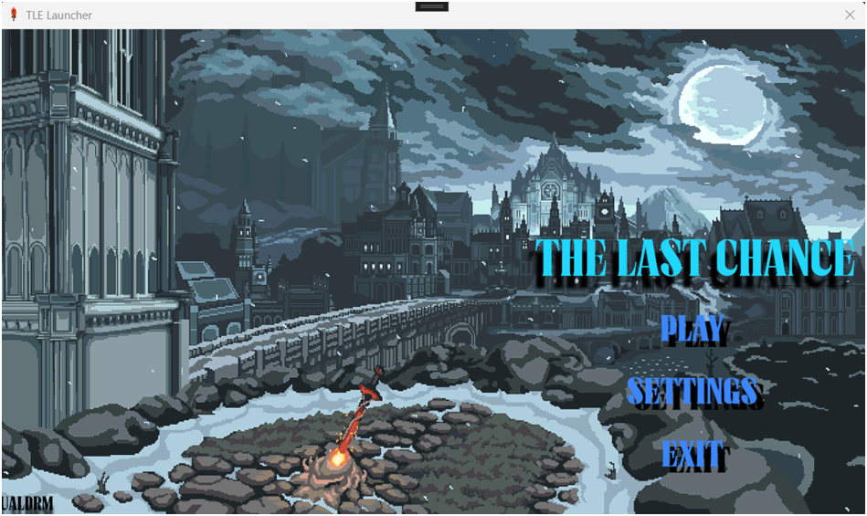
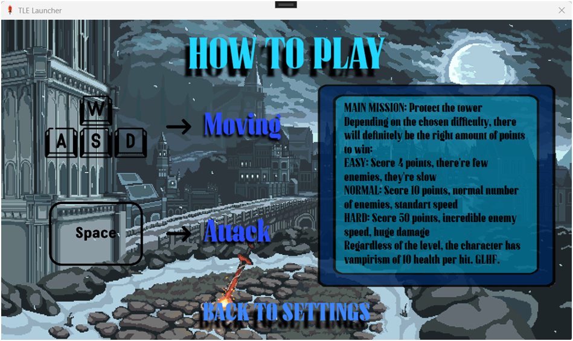
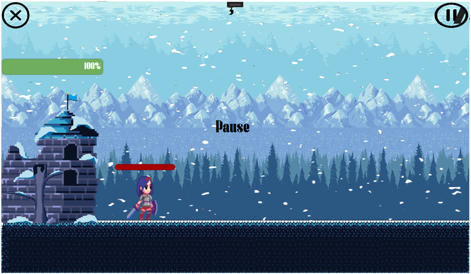

# **TLC - The Last Chance**
### My second chance to get to know GameDev better - new game **TLC**.
At the design stages, it was supposed to make a game of the _"Tower Defense"_ genre, in fact, without understanding the features of the genre. To be honest, I assumed that the genre of such games involves tower protection, but I did not know that in the main game such a theme is implemented with a top view, build some-find a tower and their improvements (like the game _"Kingdom Rush"_/_"Plants vs Zombie"_). Therefore, the _"Tower Defense"_ field turned out to be the _"Platformer"_ field ~~(without a platform)~~  
However, unlike the first attempt, I use **C#** + **OOP** here. And honestly, it was more convenient for me to design in **C#** with an already built-in _constructor_ in which you can automatically structure, arrange and align some buttons or triggers, and using Visual Studio the process turned into some kind of LEGO.  
Not to say that it was easy - not at all, but I liked designing games in **C++** more. Although **C#** has its advantages in the same garbage collector, but still something was wrong.  
The implementation will be shown next:  
  
  

